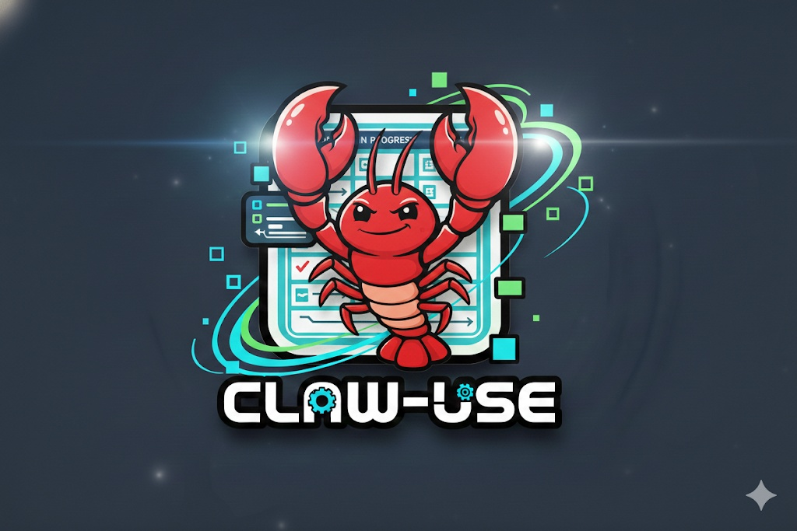

# 🦞 claw-use — OpenClaw Command Center as an MCP App 🦞

> **Dashboards show. MCP Apps think and act.**
>
> claw-use is the only place where you see your agents, the AI thinks about what it sees, and you can act on it — all in one conversation.



A **conversational command center** for [OpenClaw](https://openclaw.io) AI agent clusters, built as an MCP App. Monitor sessions, supervise running tasks, steer agent behavior mid-execution, and dispatch new work — all through natural conversation in ChatGPT or Claude. **No tab switching. No re-explaining.**

**Live Demo:** [`https://late-river-13b96.run.mcp-use.com/mcp`](https://inspector.manufact.com/inspector?autoConnect=https%3A%2F%2Flate-river-13b96.run.mcp-use.com%2Fmcp)

## The Problem

OpenClaw runs persistent AI agent clusters 24/7 — Discord bots, scheduled cron jobs, webhooks, heartbeat monitors. But managing them means SSH-ing into servers, tailing logs, running `openclaw doctor`. Existing dashboards show status (Running / Done / Failed) but can't judge content or let you intervene mid-execution.

**Telegram gives you the output — after it's done.**
**Dashboards give you the status — running, done, failed.**
**claw-use gives you the content — and lets you steer it before it's too late.**

## Demo Walkthrough

### 1. Connect & See Everything

> *"Show me what's running."*

Connect to your OpenClaw gateway via Cloudflare tunnel. The dashboard renders instantly — all active sessions, cron jobs, Discord channels, token usage, cost breakdown. No terminal needed.

### 2. Review Existing Work

> *"Email digest finished at 6 AM. News collection is running. PR report is scheduled for Friday. Looks clean."*

Browse what your agents have been doing in the background. See conversation history, token consumption per session, context window utilization. Everything the `openclaw doctor` command shows — but visual and interactive.

### 3. Trigger New Work

> *"Write a blog post about MCP Apps based on research and upload it."*

One sentence — the agent breaks it into tasks automatically. Research runs in parallel across multiple sources. Outline and upload are queued. The board updates in real-time.

### 4. Supervise In Progress

> *"I want to see how the research is going."*

Click into the research session. See sources being collected in real-time — 28 so far, titles streaming in live. This is **not** a status check. You're reading what the agent is actually finding.

### 5. Catch & Correct Mid-Execution

> *"Wait — these aren't about MCP Apps. These are about the protocol in general."*
>
> AI: *"You're right. I'll filter out protocol-only content. 6 removed, continuing with adjusted filter."*

You caught bad data **while collection was still running**. On a traditional dashboard, this would just show "Running." No way to see what's being collected, no way to intervene.

### 6. Modify the Pipeline On-the-Fly

> *"I'd like drafts in English, Korean, and Japanese."*
>
> AI: *"Adding three draft tasks. They'll run in parallel. Upload waits for all three."*

Three steps added to a **running workflow**. One sentence. No config file. No redeployment. The pipeline expanded while it was executing.

### 7. Review, Approve, Ship

> *"Let me check the English version."* ... *"Approved. Upload all three."*

Review the actual content. Approve or reject. Upload. Done — without ever leaving the conversation.

## Why This Needs to Be an MCP App

This project **couldn't exist without the MCP Apps paradigm**:

| Traditional Dashboard | claw-use (MCP App) |
|---|---|
| Shows status: Running / Done / Failed | Shows actual content being produced |
| Read-only monitoring | Send commands, steer agents mid-execution |
| Can't judge quality | LLM analyzes output and flags issues |
| Fixed pipeline | Modify workflow on-the-fly via conversation |
| Requires context switching | Everything in one conversation thread |

The key insight: **an MCP App is the only interface where the UI shows data, the AI reasons about it, and the user acts — all in the same place.**

## Architecture

```
User (ChatGPT/Claude)
    ↕ MCP Protocol
claw-use (MCP Server on Manufact Cloud)
    ↕ HTTP REST API
OpenClaw Gateway (user's agent cluster, via Cloudflare Tunnel)
    ↕ manages
AI Agents (Discord bots, Cron jobs, Webhooks, Heartbeats)
```

### Tools

| Tool | Purpose |
|------|---------|
| `connect-openclaw` | Connect to a gateway (must be called first) |
| `get-dashboard` | Visual monitoring widget with sessions and metrics |
| `send-message` | Send commands to agents and receive replies |
| `list-sessions` | Discover all active session keys |
| `get-session-history` | Browse conversation history of any session |
| `get-metrics` | Token usage, cost, success rate, context utilization |
| `create-task` / `update-task` | Dispatch and manage tasks via agents |

### Widget ↔ Model Interactions

- `useCallTool("connect-openclaw")` — Setup form connects to gateway, LLM sees the result
- `useCallTool("refresh-dashboard")` — Refresh button fetches live data through MCP
- `sendFollowUpMessage()` — "Ask AI" button triggers LLM analysis of a task
- Widget state persists across invocations via `useWidget`

### Widget Features

- Session list grouped by status (Active / Heartbeat / Scheduled / Chat / Idle)
- Per-session token count with context utilization bar
- Last message preview from conversation history
- Channel breakdown visualization (Discord / Webchat / Cron)
- "Try Demo" for instant onboarding

## Quick Start

### Try it now

Open the [Inspector](https://inspector.manufact.com/inspector?autoConnect=https%3A%2F%2Flate-river-13b96.run.mcp-use.com%2Fmcp), call `get-dashboard`, and click **Try Demo**.

### Connect to ChatGPT

1. [ChatGPT Apps Settings](https://chatgpt.com/apps#settings/Connectors) → Create App
2. Name: `claw-use`
3. URL: `https://late-river-13b96.run.mcp-use.com/mcp`
4. Auth: No Authentication
5. Type `@claw-use` in any chat

### Run locally

```bash
npm install && npm run dev
# Open http://localhost:3000/inspector
```

### Deploy

```bash
npm run deploy
```

## Tech Stack

- **Server:** TypeScript + [mcp-use](https://mcp-use.com)
- **Widget:** React 19 + Tailwind CSS 4 + [@openai/apps-sdk-ui](https://www.npmjs.com/package/@openai/apps-sdk-ui)
- **Deployment:** [Manufact Cloud](https://manufact.com)
- **Protocol:** [Model Context Protocol](https://modelcontextprotocol.io/)

## License

MIT
